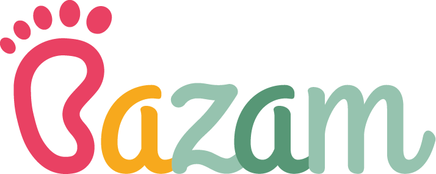

<h1 style="border-bottom: 3px solid grey" align="center" >
<a href="https://bazam.vercel.app" >
</a ></h1>

### My Capstone Project [@neuefische](https://www.neuefische.de/)

Bazam is a regional marketplace for baby and children's clothing.

The app offers young and expectant parents the opportunity to sell and buy second hand clothing regionally.

The personal contact to other parents has an important value as well as the ecological thought, cause you sell and by only in your “neighborhood”.

Bazam was built with Next.js and optimized for mobile use with 375x667px (e.g. iPhone SE 2nd gen or iPhone 6/7/8).

## Bazam App

[bazam.vercel.app](https://bazam.vercel.app)

# screenshots !!!!!

## **Tech Stack**

- React
- React Hooks
- Next.js
- Styled components
- Cloudinary
- Jest
- React Testing Libary

## **Project Setup**

- Clone this repository.
- Install all npm dependencies
  `npm install`
- To run the app in development mode with `npm run dev`

- Open [http://localhost:3000](http://localhost:3000/) to display it in the browser
- Toggle the device view to iPhone SE 2nd gen, iPhone 6/7/8 or width 375px and height 667px
